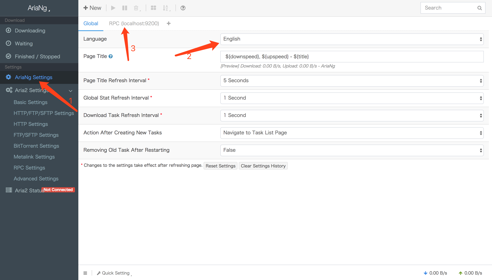
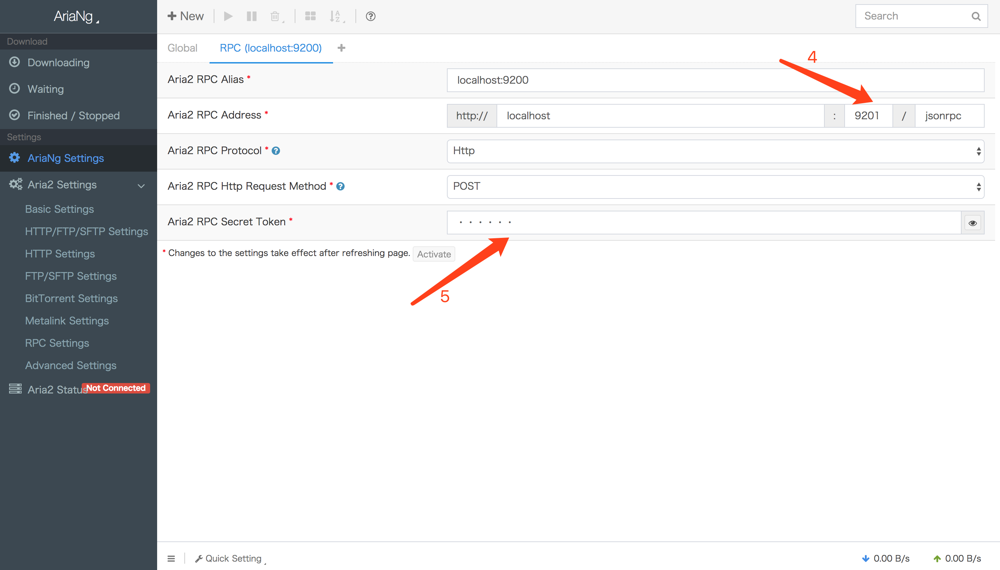

# aria2ui
Aria2结合AriaNg界面，使用docker构建的私人下载器 

# usage  

## 本地构建 
本地需要安装docker，本例使用Mac环境。  
步骤：**其中第3步和第4步任选其一。**
1. git pull https://github.com/axiowse/aria2ui.git
2. cd aria2ui
3. docker build --tag=aria2ui .
4. docker container run -idt --name=aria2ui -p 8080:80 -p 6800:6800 -e aria2ui
5. docker container run -idt --name=aria2ui -p 8080:80 -p 6800:6800 -e RPC_SECRET=123456 aria2ui
6. 在浏览器中打开 http://localhost:8080 

## 直接使用Docker镜像
步骤：**其中第2步和第3步任选其一。**
1. docker pull axiowse/aria2ui
2. docker container run -idt --name=aria2ui -p 8080:80 -p 6800:6800 -e aria2ui
3. docker container run -idt --name=aria2ui -p 8080:80 -p 6800:6800 -e RPC_SECRET=123456 aria2ui
4. 在浏览器中打开 http://localhost:8080

# 配置

在打开的浏览器中，选中左侧菜单中的AriaNg Settings，在右侧设置语言为简体中文。图中第四步用于设置aria2c的jsonrpc端口。如果在**运行docker镜像的时候指定了RPC_SECRET参数，则需要在图中第五步填入RPC_SECRET的值**。
